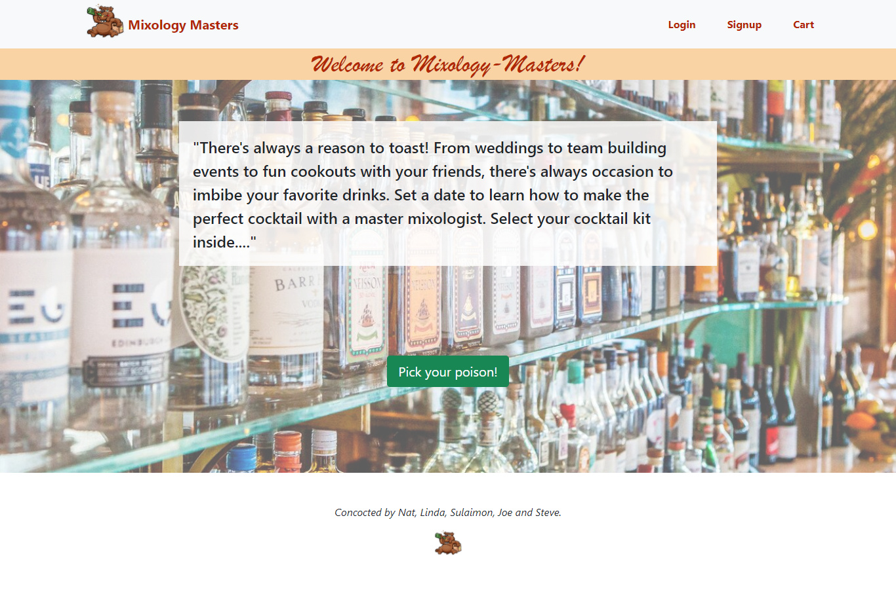

# Mixology-Masters

  ## Table of Contents
  - [Description](#description)
  - [Installation](#installation)
  - [Usage](#usage)
  - [Technologies](#technologies)
  - [Preview](#preview)
  - [Contributors](#contributors)
  - [Launch](#launch)
  - [License](#license)
  - [Badges](#badges)

  ## Description

  
  ## Installation
  Install Visual Studio Code and Node.js to make use of this application React-Bootstrap and Bootstrap.

  ## Usage
  Gives members a Cocktail Package to there home so the can enjoy cocktails with friend in person or over zoom. 

  ## Technologies
  - JavaScript
  - Node.js
  - React
  - React-Bootstrap

  ## Preview
  

  

  ## Contributors
  Joe Maneira:
  https://github.com/Maneira3232

  Linda Waterhouse:
 https://github.com/llwaterhouse
  
  Steve Koutsodontis:
  https://github.com/SteveKoutsodontis

  Sulaimon Fedai:
  https://github.com/sfedai

  Nat Epstein:
  https://github.com/natpitt2393

  ## Launch
  https://github.com/SteveKoutsodontis/Mixology-Masters

  launched app here --->

  ## License
  MIT License

    Copyright (c) [2021] [Hypochondriacs]
    
    Permission is hereby granted, free of charge, to any person obtaining a copy
    of this software and associated documentation files (the "Software"), to deal
    in the Software without restriction, including without limitation the rights
    to use, copy, modify, merge, publish, distribute, sublicense, and/or sell
    copies of the Software, and to permit persons to whom the Software is
    furnished to do so, subject to the following conditions:
    
    The above copyright notice and this permission notice shall be included in all
    copies or substantial portions of the Software.
    
    THE SOFTWARE IS PROVIDED "AS IS", WITHOUT WARRANTY OF ANY KIND, EXPRESS OR
    IMPLIED, INCLUDING BUT NOT LIMITED TO THE WARRANTIES OF MERCHANTABILITY,
    FITNESS FOR A PARTICULAR PURPOSE AND NONINFRINGEMENT. IN NO EVENT SHALL THE
    AUTHORS OR COPYRIGHT HOLDERS BE LIABLE FOR ANY CLAIM, DAMAGES OR OTHER
    LIABILITY, WHETHER IN AN ACTION OF CONTRACT, TORT OR OTHERWISE, ARISING FROM,
    OUT OF OR IN CONNECTION WITH THE SOFTWARE OR THE USE OR OTHER DEALINGS IN THE
    SOFTWARE.
  ## Badges
  
  ## License Link
  [Click Me](https://opensource.org/licenses/MIT) 